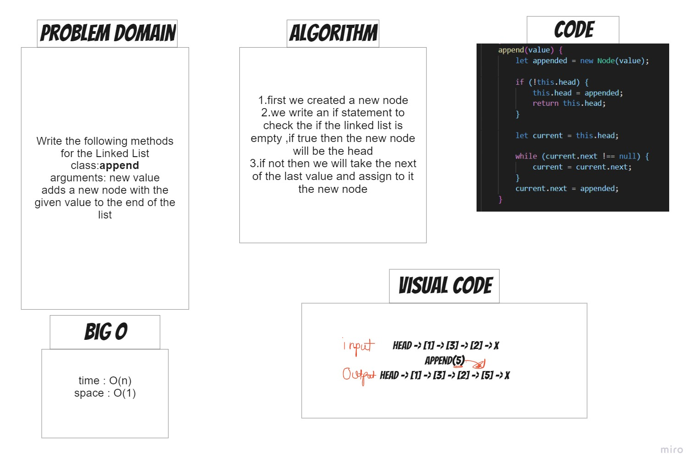
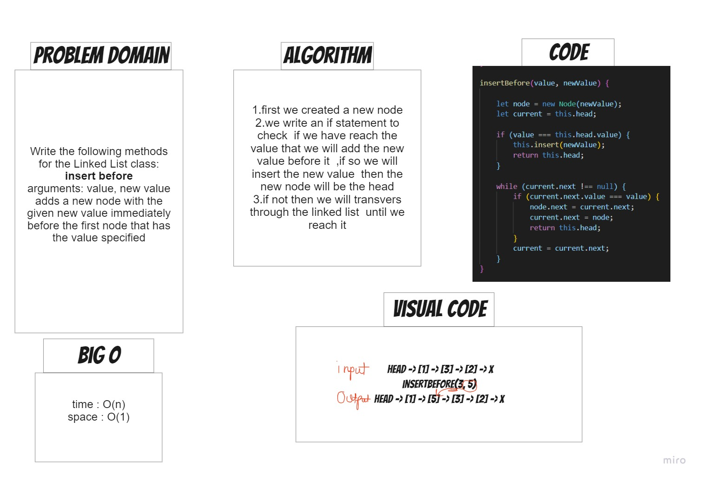
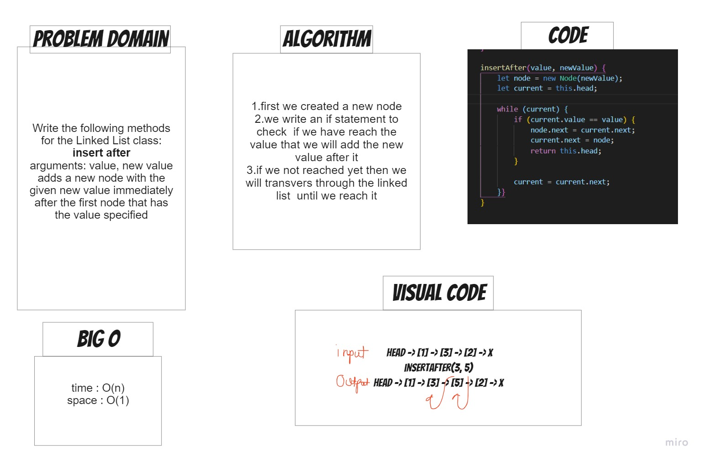

# linked list insertions

# Challenge Summary

we will writing these methods for the Linked List class:

**append**
arguments: new value
adds a new node with the given value to the end of the list
**insert before**
arguments: value, new value
adds a new node with the given new value immediately before the first node that has the value specified
**insert after**
arguments: value, new value
adds a new node with the given new value immediately after the first node that has the value specified

## Whiteboard Process
**append**

**insert before**

**insert after**

## Approach & Efficiency

**append**
Time Complexity: O(N) 
Auxiliary Space: O(1)

**insert before**
Time Complexity: O(N) 
Auxiliary Space: O(1)

**insert after**
Time Complexity: O(N) 
Auxiliary Space: O(1)

